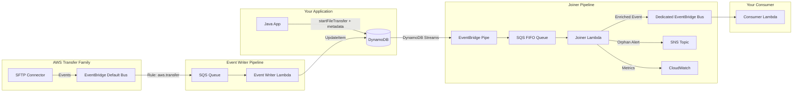

# SFTP Connector Helper Library

A framework that adds **business metadata correlation** to AWS Transfer Family SFTP Connector operations. It bridges the gap between your application's business context and the asynchronous events produced by SFTP Connector, delivering enriched events that carry your custom metadata alongside Transfer Family's native event data.

## Key Features

- **Metadata correlation** — Attach arbitrary JSON metadata to any SFTP Connector operation (file transfer, directory listing, move, delete)
- **Enriched events** — Consume events on a dedicated EventBridge bus with your metadata already joined
- **Idempotent by design** — DynamoDB `UpdateItem` with conditional writes ensures at-least-once, safe-to-retry semantics
- **Orphan detection** — Automatic alerting when Transfer Family events arrive without matching metadata
- **Turnkey deployment** — Single CDK construct deploys the entire pipeline
- **Directory listing filter** — Regex-based filtering of listing results directly from EventBridge events

## Architecture



## Quick Start

### Prerequisites

- AWS CDK v2 installed (`npm install -g aws-cdk`)
- Python 3.12+ with `uv` package manager
- Java 17+ with Maven
- AWS credentials configured

### Deploy

```bash
git clone <this-repo>
cd sftp-connector-helper-lib
make deploy
```

This builds the Lambda packages and runs `cdk deploy`, creating all infrastructure in your account.

### First API Call (Java)

```java
import io.github.jcjorel.sftpconnectorhelper.SftpConnectorHelper;
import io.github.jcjorel.sftpconnectorhelper.SftpOperationResult;
import software.amazon.awssdk.services.transfer.model.StartFileTransferRequest;
import software.amazon.awssdk.services.transfer.model.StartFileTransferResponse;

SftpConnectorHelper helper = SftpConnectorHelper.builder()
    .tableName("sftp-connector-helper")  // optional, this is the default
    .build();

StartFileTransferRequest request = StartFileTransferRequest.builder()
    .connectorId("c-1234567890abcdef0")
    .sendFilePaths("/outbound/invoice-001.csv")
    .build();

String metadata = "{\"orderId\":\"ORD-001\",\"customer\":\"ACME\"}";

SftpOperationResult<StartFileTransferResponse> result = helper.startFileTransfer(request, metadata);

switch (result) {
    case SftpOperationResult.Success<StartFileTransferResponse> s ->
        System.out.println("Transfer started: " + s.response().transferId());
    case SftpOperationResult.MetadataWriteFailed<StartFileTransferResponse> f ->
        System.err.println("Transfer OK but metadata write failed: " + f.cause().getMessage());
    case SftpOperationResult.MetadataAlreadyExists<StartFileTransferResponse> e ->
        System.err.println("Duplicate metadata for job: " + e.jobId());
}
```

### Consuming Enriched Events

Create a Lambda that subscribes to the dedicated EventBridge bus (`sftp-connector-helper-bus`):

```python
def lambda_handler(event, context):
    detail = event["detail"]
    metadata = detail.get("_helper_metadata", {})

    order_id = metadata.get("orderId")
    status = detail.get("status-code")
    file_path = detail.get("file-path")

    print(f"Order {order_id}: file {file_path} status={status}")
```

## CDK Construct Reference

```python
from sftp_connector_helper.construct import SftpConnectorHelper, SftpConnectorHelperProps
import aws_cdk as cdk

props = SftpConnectorHelperProps(
    existing_table_arn=None,           # str | None — Use existing DynamoDB table (skips table creation)
    existing_bus_arn=None,             # str | None — Use existing EventBridge bus (skips bus creation)
    ttl_duration=cdk.Duration.days(1), # Duration — TTL for DynamoDB records (default: 1 day)
    event_writer_memory=256,           # int — Event Writer Lambda memory in MB (default: 256)
    event_writer_timeout=cdk.Duration.seconds(30),  # Duration — Event Writer timeout (default: 30s)
    joiner_memory=256,                 # int — Joiner Lambda memory in MB (default: 256)
    joiner_timeout=cdk.Duration.seconds(30),        # Duration — Joiner timeout (default: 30s)
)

helper = SftpConnectorHelper(self, "SftpHelper", props)

# Exposed properties:
helper.table       # dynamodb.ITable
helper.event_bus   # events.IEventBus
helper.orphan_topic  # sns.ITopic
```

See [cdk/README.md](cdk/README.md) for TTL staggering details and singleton enforcement.

## Java Library API Reference

### Builder

```java
SftpConnectorHelper helper = SftpConnectorHelper.builder()
    .tableName("sftp-connector-helper")   // optional, default: "sftp-connector-helper"
    .ttlDuration(Duration.ofHours(24))    // optional, default: 24 hours
    .dynamoDbClient(customDynamoClient)   // optional, creates default client
    .transferClient(customTransferClient) // optional, creates default client
    .build();
```

`SftpConnectorHelper` implements `AutoCloseable` — use try-with-resources or call `close()` to release SDK clients.

### Wrapper Methods

| Method | SDK Operation | Returns |
|--------|--------------|---------|
| `startFileTransfer(request, metadata)` | `StartFileTransfer` | `SftpOperationResult<StartFileTransferResponse>` |
| `startDirectoryListing(request, metadata)` | `StartDirectoryListing` | `SftpOperationResult<StartDirectoryListingResponse>` |
| `startRemoteMove(request, metadata)` | `StartRemoteMove` | `SftpOperationResult<StartRemoteMoveResponse>` |
| `startRemoteDelete(request, metadata)` | `StartRemoteDelete` | `SftpOperationResult<StartRemoteDeleteResponse>` |

All methods:
- Validate metadata (must be valid JSON object, ≤ 8 KB)
- Execute the SDK call first
- Write metadata to DynamoDB with conditional check
- Return a typed result indicating the outcome

### Result Types

```java
sealed interface SftpOperationResult<T> {
    record Success<T>(T response) implements SftpOperationResult<T> {}
    record MetadataWriteFailed<T>(T response, String jobId, Exception cause) implements SftpOperationResult<T> {}
    record MetadataAlreadyExists<T>(T response, String jobId) implements SftpOperationResult<T> {}
}
```

- **`Success`** — SDK call and metadata write both succeeded
- **`MetadataWriteFailed`** — SDK call succeeded, DynamoDB write failed (network/throttle). The transfer is in progress but metadata won't be joined.
- **`MetadataAlreadyExists`** — SDK call succeeded, but metadata was already written for this job ID (indicates a caller bug or retry)

### DirectoryListingFilter

Filters directory listing S3 output by regex patterns:

```java
DirectoryListingFilter filter = new DirectoryListingFilter(s3Client);
DirectoryListingResult result = filter.filter(eventJson, "\\.csv$", null);
// result.files() — filtered file entries
// result.paths() — filtered path entries (null pathRegex = include all)
// result.truncated() — "true"/"false" from original listing
```

Parameters:
- `fileRegex`: `null` = include all files, `""` = exclude all, otherwise `Matcher.find()` on `filePath`
- `pathRegex`: `null` = include all paths, `""` = exclude all, otherwise `Matcher.find()` on `path`

## Enriched Event Format

Events published to the dedicated bus (`sftp-connector-helper-bus`):

```json
{
  "source": "aws.transfer",
  "detail-type": "SFTP Connector File Transfer Complete",
  "detail": {
    "transfer-id": "t-abc123",
    "file-transfer-id": "ft-xyz789",
    "connector-id": "c-1234567890abcdef0",
    "status-code": "COMPLETED",
    "file-path": "/outbound/invoice-001.csv",
    "_helper_metadata": {
      "orderId": "ORD-001",
      "customer": "ACME"
    }
  }
}
```

The `source` and `detail-type` are preserved from the original Transfer Family event. The `_helper_metadata` field is injected into `detail` by the Joiner Lambda.

## Idempotency Contract

- **DynamoDB writes use `UpdateItem` with `attribute_not_exists(metadata)` condition** — safe to retry without duplicating data
- **At-least-once delivery** — enriched events may be delivered more than once to your consumer (SQS + Lambda standard behavior)
- **Consumer guidance** — design consumers to be idempotent (use `file-transfer-id` or `transfer-id` as deduplication key)
- **Fan-out correlation** — `StartFileTransfer` with multiple files creates one master record; per-file events are joined via `transferId-index` GSI

## Cost Estimates

| Scenario | Monthly Cost |
|----------|-------------|
| Simple operations (listing/move/delete, 10K ops/day) | < $2 |
| Fan-out dominant (10K StartFileTransfer × 5 files avg) | $7–12 |

Costs are dominated by DynamoDB writes and Lambda invocations. EventBridge Pipes and SQS are negligible at these volumes.

## End-to-End Example

### 1. Deploy Infrastructure

```bash
make deploy
```

### 2. Call from Java Application

```java
SftpConnectorHelper helper = SftpConnectorHelper.builder().build();

StartFileTransferRequest req = StartFileTransferRequest.builder()
    .connectorId("c-1234567890abcdef0")
    .sendFilePaths("/data/report.pdf")
    .build();

var result = helper.startFileTransfer(req, "{\"batchId\":\"B-2026-05\"}");
```

### 3. Consume Enriched Event (Lambda)

```python
import json

def lambda_handler(event, context):
    """Subscribe this to sftp-connector-helper-bus with rule matching your needs."""
    detail = event["detail"]
    batch_id = detail["_helper_metadata"]["batchId"]
    status = detail["status-code"]

    if status == "COMPLETED":
        print(f"Batch {batch_id} file delivered successfully")
    else:
        print(f"Batch {batch_id} transfer failed: {status}")
```

## Operational Runbook

### Orphan Alerts

**Symptom:** SNS notification from the orphan alert topic.

**Meaning:** The Joiner Lambda detected a Transfer Family event in DynamoDB that has no matching metadata — the application didn't call the helper library before the transfer completed.

**Resolution:**
1. Check CloudWatch metric `SftpConnectorHelper/OrphanedRecords`
2. Verify your application is calling `helper.startFileTransfer()` before the SFTP Connector processes the file
3. If metadata write failed (network issue), the `MetadataWriteFailed` result type should have been handled in your application

### DLQ Inspection

**Event Writer DLQ** (`sftp-connector-helper-event-writer` DLQ):
- Standard SQS queue — messages that failed 3 processing attempts
- Inspect message body for the original EventBridge event
- Common cause: DynamoDB throttling or Lambda errors

**Joiner DLQ** (`sftp-connector-helper-joiner-dlq.fifo`):
- FIFO queue — messages that failed 3 processing attempts
- Contains DynamoDB stream records that couldn't be joined
- Redrive after fixing the root cause

### Pipe DLQ Replay

**Queue:** `sftp-connector-helper-pipe-dlq`

EventBridge Pipe failures (DynamoDB Streams → SQS FIFO) land here. To replay:
1. Inspect messages in the DLQ (they contain raw DynamoDB stream records)
2. Fix the underlying issue (Pipe permissions, SQS FIFO quota)
3. Use SQS redrive to move messages back to the Joiner FIFO queue

### IteratorAge Alarm

**Symptom:** CloudWatch alarm `PipeIteratorAgeAlarm` fires (IteratorAge > 60s for 3 consecutive minutes).

**Meaning:** The EventBridge Pipe is falling behind DynamoDB Streams — the Joiner pipeline is stalled.

**Resolution:**
1. Check Pipe status in EventBridge Pipes console
2. Check Joiner Lambda errors in CloudWatch Logs
3. Check SQS FIFO queue depth — may be at capacity
4. If Pipe is stopped, restart it from the console

## Troubleshooting

| Issue | Cause | Resolution |
|-------|-------|------------|
| `MetadataWriteFailed` result | DynamoDB throttle or network error | Retry the operation; the transfer is already in progress |
| `MetadataAlreadyExists` result | Duplicate call with same job ID | Bug in caller — each operation should be called once |
| No enriched events appearing | Event Writer not processing | Check Event Writer DLQ and Lambda logs |
| Enriched events missing metadata | Metadata written after event arrived | Ensure `startFileTransfer()` is called before SFTP Connector processes the file |
| CDK deploy fails with name collision | Singleton enforcement | Only one stack per account/region; destroy the existing stack first |
| `IllegalArgumentException: metadata` | Invalid JSON or > 8 KB | Ensure metadata is a valid JSON object under 8 KB |

## Project Structure

```
├── helpers/java/          # Java helper library (Maven)
├── lambdas/
│   ├── event-writer/      # Captures Transfer Family events into DynamoDB
│   └── joiner/            # Joins metadata + events, publishes enriched events
├── cdk/                   # CDK construct and deployment
├── tests/integration/     # End-to-end integration tests
└── Makefile               # Build orchestration
```

## Build Commands

| Command | Description |
|---------|-------------|
| `make build` | Build Java library + Lambda packages |
| `make deploy` | Build Lambdas + CDK deploy |
| `make test` | Run Java unit tests |
| `make test-integration` | Run integration tests (requires deployed stack) |
| `make clean` | Clean Java build artifacts |
